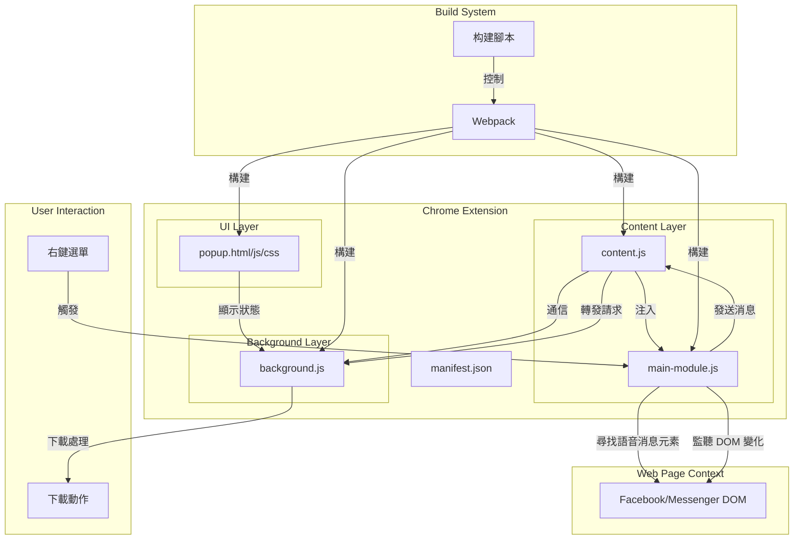

# Facebook Messenger 語音消息下載器架構文檔

## 專案概述

這是一個 Chrome 瀏覽器擴展，專門用於在 Facebook Messenger 中下載語音消息。該擴展通過識別網頁中的語音消息元素，並提供下載功能，使用戶能夠保存 Facebook Messenger 中的語音消息。

## 架構圖



## 核心組件

### 1. 清單文件 (manifest.json)
- 定義擴展的元數據、權限和組件
- 指定 background、content scripts 和 popup 等擴展元素
- 配置擴展圖標和許可權限 (activeTab)

### 2. 背景腳本 (background.js)
- 作為擴展的中央控制器
- 處理從內容腳本發送的消息
- 管理下載功能和資源請求攔截
- 負責擴展的生命週期管理

### 3. 內容腳本 (content.js)
- 注入到 Facebook 和 Messenger 頁面中
- 負責與頁面 DOM 交互
- 注入主模塊腳本到頁面上下文
- 作為頁面上下文和擴展背景腳本之間的橋樑

### 4. 主模塊 (main-module.js)
- 在頁面上下文中執行
- 識別並追踪頁面中的語音消息元素
- 監聽 DOM 變化以找到新添加的語音消息
- 處理右鍵菜單事件，識別用戶意圖

### 5. 彈出界面 (popup.html/js/css)
- 提供用戶界面
- 顯示擴展的當前狀態
- 可能提供設置或統計信息

## 數據流程

1. **初始化流程**:
   - 擴展安裝或啟動時，background.js 初始化
   - 當用戶訪問 Facebook 或 Messenger 時，content.js 被注入到頁面
   - content.js 在頁面中注入 main-module.js
   - main-module.js 開始掃描頁面並使用 MutationObserver 監聽 DOM 變化

2. **語音消息識別流程**:
   - main-module.js 通過角色和標籤選擇器識別語音消息元素
   - 識別到的元素被標記並註冊到系統中
   - 為每個語音消息元素分配唯一 ID 和記錄持續時間

3. **下載流程**:
   - 用戶在語音消息上右鍵點擊
   - main-module.js 攔截此事件並確認目標是語音消息
   - 事件數據通過 content.js 發送到 background.js
   - background.js 處理下載請求，獲取實際音頻 URL
   - 文件被下載到用戶系統

## 關鍵技術

1. **DOM 識別與交互**:
   - 使用角色和標籤屬性識別語音消息元素，如 `[role="button"][aria-label="播放"]`
   - 透過 `document.querySelectorAll` 和相關技術查找元素
   - 使用 `MutationObserver` 監聽頁面變化

2. **消息通信**:
   - 使用 `window.postMessage` 在頁面上下文和內容腳本之間通信
   - 使用 `chrome.runtime.sendMessage` 在內容腳本和背景腳本之間通信
   - 設計了多層次錯誤處理和回退機制

3. **右鍵菜單攔截**:
   - 攔截 `contextmenu` 事件以識別用戶在語音消息上的右鍵點擊
   - 確定點擊目標是否為語音消息元素或其容器

4. **構建系統**:
   - 使用 Webpack 構建和打包擴展
   - 區分開發和生產環境配置
   - 使用打包腳本生成最終發布版本

## 數據模型

語音消息元素在系統中表示如下:

```javascript
{
  elementId: "voice-msg-[timestamp]-[random]", // 唯一標識符
  durationMs: 15000,                          // 語音消息持續時間(毫秒)
  downloadUrl: null,                          // 下載 URL (由背景腳本填充)
  lastModified: null                          // 檔案時間戳 (可選)
}
```

## 開發與構建流程

1. **開發環境**:
   - 使用 Webpack 的開發配置運行 `npm run dev`
   - 開啟實時重載和 sourcemap 支持
   - 自動將構建文件部署到開發目錄

2. **測試**:
   - 使用 Jest 進行單元測試，運行 `npm test`
   - 測試設置在 jest.config.js 中配置

3. **構建生產版本**:
   - 運行 `npm run build` 使用生產配置
   - 優化、最小化代碼
   - 構建結果輸出到 dist 目錄

4. **打包發布**:
   - 運行 `npm run package` 執行打包腳本
   - 生成符合 Chrome 商店要求的 ZIP 格式擴展包

## 主要挑戰和考慮事項

1. **Facebook 界面變更適應**:
   - 使用語意化選擇器而非 CSS 路徑以提高穩定性
   - 實現多層次的元素查找策略，提高適應性

2. **安全性考慮**:
   - 只請求必要的權限 (activeTab)
   - 確保不會收集或發送用戶敏感數據

3. **性能優化**:
   - 優化 DOM 查詢策略以減少性能開銷
   - 使用事件委派優化事件處理器數量

4. **未來擴展性**:
   - 模塊化設計允許未來添加更多功能
   - 可擴展到支持其他類型的媒體下載

## 開發指南

要開始開發，請按照以下步驟:

1. 克隆儲存庫
2. 安裝依賴: `npm install`
3. 啟動開發模式: `npm run dev`
4. 將 `dist` 目錄作為未打包擴展載入 Chrome

若要構建發布版本:
1. 運行 `npm run build`
2. 運行 `npm run package` 生成 ZIP 文件

## 代碼組織

```
/
├── dist/                   # 構建產物
├── docs/                   # 文檔
├── extension/              # 擴展源碼
│   ├── assets/             # 靜態資源
│   ├── background.js       # 背景腳本
│   ├── manifest.json       # 擴展清單
│   ├── popup/              # 彈出窗口
│   │   ├── popup.css
│   │   ├── popup.html
│   │   └── popup.js
│   └── scripts/            # 腳本目錄
│       └── content.js      # 內容腳本
├── tests/                  # 測試文件
├── jest.config.js          # Jest 配置
├── package.json            # 專案設定
└── package-lock.json       # 依賴鎖定
```

## 未來改進方向

1. **重構目錄結構**:
   - 創建更清晰的源碼與構建分離
   - 實現更好的模塊化組織

2. **擴充功能**:
   - 添加下載歷史記錄
   - 支持批量下載
   - 擴展到其他類型媒體

3. **改進用戶界面**:
   - 提供更豐富的設置選項
   - 添加下載進度指示器

4. **代碼質量提升**:
   - 引入 TypeScript 增強類型安全
   - 增加測試覆蓋率
   - 實現更統一的日誌系統
