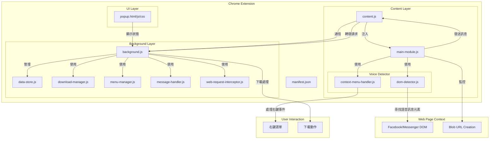

# Facebook Messenger 語音訊息下載器架構文檔

## 專案概述

這是一個 Chrome 瀏覽器擴充功能，專門用於在 Facebook Messenger 和 Facebook 網站中下載語音訊息。該擴充功能透過監控並識別網頁中的語音訊息，提供右鍵下載功能，使用戶能夠輕鬆保存這些通常難以下載的語音訊息。

## 架構圖



## 核心組件

### 1. 清單檔案 (manifest.json)
- 定義擴充功能的元數據、權限和組件
- 指定權限：`activeTab`, `contextMenus`, `downloads`, `webRequest`
- 指定 host 權限：facebook.com, messenger.com, fbcdn.net 等
- 設定 background script, content script 和擴充功能圖示

### 2. 背景腳本系統
- **background.js**：主要背景腳本，負責初始化和協調其他背景模組
- **data-store.js**：管理語音訊息資料的儲存和檢索
- **download-manager.js**：處理音訊檔案的下載功能
- **menu-manager.js**：管理右鍵選單的建立和事件處理
- **message-handler.js**：處理從內容腳本接收的訊息
- **web-request-interceptor.js**：監控並攔截網路請求，尤其是音訊相關的請求

### 3. 內容腳本系統
- **content.js**：
  - 注入到 Facebook 和 Messenger 頁面中
  - 作為頁面內容和擴充功能背景腳本之間的橋樑
  - 負責與頁面 DOM 互動和注入主模組
  - 提供 extractBlobContent 和 calculateBlobDuration 功能

- **main-module.js**：
  - 在頁面環境中執行的主要模組
  - 設置 Blob URL 監控以捕獲音訊檔案
  - 協調 DOM 偵測器和右鍵選單處理

- **voice-detector/**：
  - **dom-detector.js**：識別和追踪頁面中的語音訊息元素
  - **context-menu-handler.js**：處理用戶的右鍵選單互動

### 4. 彈出界面 (popup/)
- **popup.html**：提供用戶界面結構
- **popup.js**：處理彈出視窗的互動邏輯
- **popup.css**：定義彈出視窗的樣式

## 數據流程

### 1. 初始化流程:
- 擴充功能安裝或啟動時，background.js 初始化所有背景模組
- 當用戶訪問 Facebook 或 Messenger 時，content.js 被注入到頁面
- content.js 在頁面中注入 main-module.js
- main-module.js 初始化，設置 URL.createObjectURL 的監控以捕獲 blob URL

### 2. 語音訊息偵測流程:
- **Blob URL 監控**:
  - 當頁面創建 Blob URL 時，攔截 URL.createObjectURL 調用
  - 分析 blob 類型和大小，判斷是否可能是語音訊息
  - 計算音訊持續時間並註冊到 voiceMessagesStore

- **DOM 偵測**:
  - 透過 DOM 選擇器識別頁面中的語音訊息元素
  - 將找到的元素與對應的 Blob URL 關聯

### 3. 下載流程:
- 用戶在語音訊息上右鍵點擊
- contextMenuHandler 攔截此事件並確認目標是語音訊息
- 將要下載的 Blob URL 和相關資訊透過 content.js 發送到 background.js
- background.js 使用 download-manager.js 處理下載請求
- 提取 Blob 內容並轉換為 base64 格式
- 使用 chrome.downloads.download 下載檔案到用戶系統

## 關鍵技術

### 1. Blob URL 監控
- 攔截 URL.createObjectURL 方法以捕獲音訊 Blob URL
- 使用 Web Audio API 計算音訊持續時間
- 應用節流機制避免過度處理
- 使用 WeakMap 和 Set 數據結構防止記憶體洩漏

### 2. 訊息通信
- 使用 window.postMessage 在頁面環境和內容腳本之間通信
- 使用 chrome.runtime.sendMessage 在內容腳本和背景腳本之間通信
- 實現完整的錯誤處理和日誌系統

### 3. 音訊數據處理
- 支援提取不同格式的音訊數據
- 轉換音訊數據為 base64 格式以便下載
- 使用 Web Audio API 和 Audio 元素分析音訊特性

### 4. 錯誤處理和穩定性
- 實現多層次錯誤捕獲和恢復機制
- 定期清理過期數據防止記憶體洩漏
- 詳細的日誌系統用於診斷和除錯

## 數據模型

語音訊息在系統中表示如下:

```javascript
{
  blobUrl: "blob:https://www.messenger.com/12345-6789", // Blob URL
  blobType: "audio/mp4",                               // 音訊 MIME 類型
  blobSize: 24680,                                     // 檔案大小 (位元組)
  durationMs: 15000,                                   // 語音訊息持續時間 (毫秒)
  timestamp: "2023-10-30T12:34:56.789Z",               // 偵測時間戳
  durationCategory: "中 (10秒-1分鐘)",                  // 持續時間分類
  sizeCategory: "中 (100KB-1MB)",                       // 大小分類
  requestId: "req-12345-6789"                          // 唯一請求 ID
}
```

## 代碼組織

```
/extension
├── assets/                 # 靜態資源
│   └── icons/              # 擴充功能圖示
│       ├── icon-16.png
│       ├── icon-32.png
│       ├── icon-48.png
│       ├── icon-128.png
│       └── icon.svg
├── manifest.json           # 擴充功能清單
├── popup/                  # 彈出視窗
│   ├── popup.css           # 彈出視窗樣式
│   ├── popup.html          # 彈出視窗 HTML
│   └── popup.js            # 彈出視窗邏輯
└── scripts/                # 腳本目錄
    ├── background/         # 背景腳本模組
    │   ├── data-store.js               # 數據儲存
    │   ├── download-manager.js         # 下載管理
    │   ├── menu-manager.js             # 選單管理
    │   ├── message-handler.js          # 訊息處理
    │   └── web-request-interceptor.js  # 網路請求攔截
    ├── voice-detector/     # 語音偵測模組
    │   ├── context-menu-handler.js     # 右鍵選單處理
    │   └── dom-detector.js             # DOM 元素偵測
    ├── utils/              # 實用函數
    ├── background.js       # 主背景腳本
    ├── content.js          # 主內容腳本
    └── main-module.js      # 主模組 (頁面環境)
```

## 主要挑戰和改進策略

### 1. Facebook 界面變更適應
- 使用語意化選擇器如 aria-label 和角色屬性，而非固定 CSS 選擇器
- 實現多重偵測策略，增強對界面變更的適應能力

### 2. 安全與隱私考量
- 只請求必要的權限 (`activeTab`, `contextMenus`, `downloads`)
- 不收集用戶個人資料，只處理技術必要的數據
- 實現記憶體自動清理，防止資源占用過多

### 3. 性能優化
- 使用節流控制，避免過度處理 Blob URL
- 實現智能的音訊檔案過濾機制，減少不必要的處理
- 使用 WeakMap 和細心的記憶體管理防止洩漏

### 4. 穩定性增強
- 針對 Web Audio API 失敗實現多層次後備機制
- 詳盡的錯誤捕獲和日誌系統
- 針對不同音訊格式提供特定的處理策略

## 未來改進方向

1. **功能擴展**:
   - 支援批量下載多個語音訊息
   - 增加自訂檔案命名選項
   - 支援跨瀏覽器兼容性 (Firefox、Edge)

2. **用戶體驗提升**:
   - 添加下載進度指示器
   - 實現下載歷史記錄功能
   - 提供音訊前預覽功能

3. **程式碼品質提升**:
   - 引入 TypeScript 增強型別安全
   - 增加單元測試覆蓋率
   - 進一步模組化架構，增強可維護性

4. **效能優化**:
   - 改進 DOM 掃描策略以減少資源使用
   - 優化音訊處理流程，減少記憶體占用
   - 實現更精確的音訊檔案識別算法

## 使用指南

1. **安裝擴充功能**:
   - 從 Chrome Web Store 安裝，或以開發模式載入未打包的擴充功能

2. **使用方法**:
   - 訪問 Facebook 或 Messenger 網站
   - 找到包含語音訊息的對話
   - 在語音訊息上點擊右鍵
   - 選擇「下載語音訊息」選項
   - 語音訊息將自動下載到您的裝置

3. **疑難排解**:
   - 確保已授予擴充功能必要的權限
   - 如果語音訊息沒有被識別，嘗試重新載入頁面
   - 查看 Chrome 開發者工具中的控制台日誌以獲取詳細訊息

## 上架與維護

- 當前版本：1.0.0
- 上架於：Chrome Web Store
- 維護策略：
  - 定期測試與 Facebook 界面更新的兼容性
  - 根據用戶反饋迭代改進功能
  - 保持程式碼與最新的 Chrome 擴充功能最佳實踐一致
